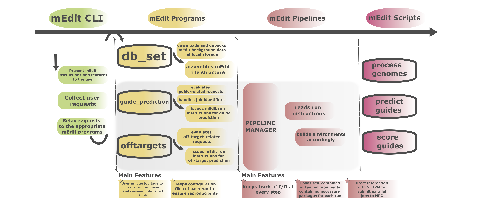

# mEdit

<!-- Badges -->


<!-- Table of Contents -->
# Table of Contents

- [What is mEdit?](#what-is-medit)
  * [Program Structure](#program-structure)
  * [Features](#features)
- [Getting Started](#getting-started)
  * [Prerequisites](#prerequisites)
  * [Installation](#installation)
  * [Running Tests](#running-tests)
- [Usage](#usage)
- [Roadmap](#roadmap)
- [Contributing](#contributing)
- [FAQ](#faq)
- [License](#license)
- [Contact](#contact)

## What is mEdit?
### Program Structure
<div align="center"> 
  
</div>

### Features
 * Reference Human Genome
   * mEdit has three different options for loading reference genomes:
   * 1- The latest compatible reference used by the HPRC on human pangenome assemblies
   * 2- The latest RefSeq human genome reference
   * 3- Custom version provided by the user
## Getting Started
### Prerequisites
 * The current version has 4 prerequisites:
   * [PIP](#pip)
   * [Anaconda](#anaconda)
   * [Mamba](#mamba)
   * [Tabix](#tabix)
   
#### PIP
  - Make sure `gcc` is installed
    ```
    sudo apt install gcc
    ```
  - Also make sure your pip up to date
    ```
    python -m pip install --upgrade pip
    ```
    * or: 
    ```
    apt install python3-pip
    ```
#### Anaconda
  - mEdit utilizes Anaconda to build its own environments under the hood. 
  - Install Miniconda:
    * Download the installer at: https://docs.conda.io/projects/miniconda/en/latest/ 
    ```
    bash Miniconda3-latest-<your-OS>.sh
    ```
  - Set up and update conda: 
    ```
    conda update --all
    conda config --set channel_priority strict
    ```
 
#### Mamba
  - The officially supported way of installing Mamba is through Miniforge.
  - The Miniforge repository holds the minimal installers for Conda and Mamba specific to conda-forge.
    * Important:
      * The supported way of using Mamba requires that no other packages are installed on the `base` conda environment
    * More information about miniforge: https://github.com/conda-forge/miniforge
    * Details on how to correctly install Mamba: https://mamba.readthedocs.io/en/latest/installation/mamba-installation.html
      ```
      wget https://github.com/conda-forge/miniforge/releases/latest/download/Miniforge-pypy3-<your-OS>.sh
      bash Miniforge-pypy3-<your-OS>.sh
      ```

#### Tabix
 * This allows mEdit to use bgzip for file compression.
   * In linux systems, install `tabix`.
      ```
        apt install tabix
     ```
   * On macOS machines, intall `htslib`.
      ```
        brew install htslib
     ```

### Installation
mEdit is compatible with UNIX-based systems running on Intel processors and it's conveniently available via pyPI:
```
pip install meditability
```

### Running Tests

## Usage

This section is under the assumption mEdit is installed properly and every runs simply using the command medit 

To run mEdit and view its sub-commands, simple execute with the  —-help flag

```
 medit —-help
```

There are four sub-commands available for mEdit

* **db\_set**: Setup the necessary background data to run mEdit  
* **list**: Prints the current set of editors available on mEdit.  
* **guide\_prediction**: The core mEdit program finds potential guides for variants specified on the input by searching a diverse set of editors.  
* **offtarget**: Predict off-target effect for the guides found  


### 1. **Database Setup**

```
$ mEdit db_set [-h] [-d DB_PATH] [-l] [-c CUSTOM_REFERENCE] [-t THREADS]
```

Database Setup is used to retrieve the required information and datasets to run medit. The contents include the reference human genome, HPRC pangenome vcf files, Refseq, MANE, clinvar and more. See the database structure below.


| Args | Description |
| :---- | :---- |
| \-d DB\_PATH | Provide the path where the "mEdit\_database" directory will be created ahead of the analysis. Requires \~3.2GB in-disk storage   \[default: ./mEdit\_database\] |
| \-l | Request the latest human genome reference as part of mEdit database unpacking. This is especially recommended when running predictions on private genome assemblies. \[default: False\] |
| \-c CUSTOM\_REFERENCE | Provide the path to a custom human reference genome  in FASTA format. \*\*\*Chromosome annotation must follow a "\>chrN" format (case sensitive) |
| \-t THREADS  | Provide the number of cores for parallel decompression of mEdit databases. |

### 2. **Editor List**

```
mEdit list [-h] [-d DB_PATH]
```

Currently in version 0.2.8, there are 24 endonuclease editors and 29 base editor stored within medit. list  prints out a list of both base editors and endonuclease editors with the parameters used for guide prediction.

**Output**;

```
Available endonuclease editors:  
-----------------------------  
name: spCas9  
pam, pam_is_first: NGG, False  
guide_len: 20  
dsb_position: -3  
notes: requirements work for SpCas9-HF1, eSpCas9 1.1,spyCas9  
5'-xxxxxxxxxxxxxxxxxxxxNGG-3'  
-----------------------------
```

| Args | Description |
| :---- | :---- |
| \-d DB\_PATH | Provide the path where the "mEdit\_database" the directory was created ahead of the analysis using the "db\_set" program. \[default: ./mEdit\_database\] |

### 3. **Guide Prediction**

guide\_prediction is the main program to search for guides given a list of variants. The pathogenic variants wished to be searched can be either from the clinvar database or a de novo variant. medit first generates variant incorporated gRNAs using the reference human genome. If the user chooses ”fast” the search will end with the human reference genome. However if the user chooses “standard” or “vcf” the medit program will also go on to predict the impact of alternative genomic variants on either the pangenome or user provided vcf file.

**Outputs;**  
FAST : A guide report table(s) of the variant editable guides derived from the human reference genome. A gene table and a clinically relevant table based on the search.

STANDARD: The output given by FAST, as well as a summary of variants found near the target sites identified in the pangenome assemblies and a guide report with guides impacted (

VCF: The same results as the FAST search as well as 

| Required Input |  |
| ----- | :---- |
| **Args** | **Description** |
| \-i QUERY\_INPUT | Path to plain text file containing the query (or set of queries) of variant(s) for mEdit analysis. See \--qtype for formatting options. |
| \-o OUTPUT | Path to root directory where mEdit outputs will be stored \[default: mEdit\_analysis\_\<jobtag\>/\] |
| \-d DB\_PATH | Provide the path where the "mEdit\_database" directory was created ahead of the analysis using the "db\_set" program.\[default: ./mEdit\_database\] |
| \-j JOBTAG | Provide the tag associated with the current mEdit job. mEdit will generate a random jobtag by default |
| \-m {fast,standard,vcf} | The MODE option determines how mEdit will run your job.\[default \= "standard"\] \[1-\] "fast": will find and process guides based only on one reference human genome. \[2-\] "standard": will find and process guides based on a reference human genome assembly along with a diverse set of pangenomes from HPRC. \[3-\] "vcf": will find and process guides based only on reference human genome and a given vcf file. requires a private VCF file that will be processed for guide prediction. |
| \-v CUSTOM\_VCF | Provide a gunzip compressed VCF file to run mEdit’s vcf mode |
| \--qtype {hgvs,coord, gene, rsid} | Set the query type provided to mEdit. \[default \= "hgvs"\]  \[1-\] "hgvs": must at least contain the Refseq identifier followed by “:” and the commonly used HGVS nomenclature.  Example: NM\_000518.5:c.114G\>A \[2-\] "coord": must contain hg38 coordinates followed by (ALT\>REF). Alleles must be the plus strand.Example: chr11:5226778C\>T \[3-\]”gene”: Gene name \[4-\]”rsid”: dbSNP ID |
| **Optional Arguments** |  |
| \--editor editor\_request {clinical, user\_define\_list, custom} | Delimits the set of editors to be used by mEdit. \[default \= "clinical"\] Use the "medit list" prompt to access the arrays of editors currently supported in each category.  \[1-\] "clinical": a short list of clinically relevant editors that are either in pre-clinical or clinical trials. \[2-\] "user\_defined\_list": \- one more editors chosen from, comma-separated list chosen from the “medit list” of editors \[3-\] "custom": select guide search parameters. This requires a separate input of parameters : ‘pam’, ‘pamISfirst’,’guidelen’,’dsb\_pos |
| \--be {off,default, custom,user defined list} | Add this flag to allow mEdit process base-editors.  \[default \= off\] \[1-\] “off”: disable base editor guides searching. \[2-\] “default”: use generic ABE and CBE with ‘NGG’ PAM and 4-8 base editing window \[3-\] “custom”: : select base editor search parameters. This requires a separate input of parameters : ‘be\_pam’, ‘be\_pamISfirst’,’be\_guidelen’,’be\_win’,’target\_base’,’result\_base’ \[4-\]"user defined list": \- Comma-separated list chosen from the “medit list” of base editors  |
| –guidelen | endonuclease spacer length for a custom editor. \[default \=20\] ONLY/MUST be defined for for ‘custom’ editor |
| \-pamisfirst  | Whether the PAM site is 5’ of target site \[default \= False\]. Can ONLY be used for a ‘custom’ editor  |
| \-pam | pam sequence. string of IUPAC codes ONLY use for ‘custom’ endonuclease |
| —dsb\_pos | Double strand cut site relative to pam. This can be a single integer with a blunt end endonuclease or 2 integers separated by a single comma when using an endonuclease that produces staggered end cuts. for example spCas9 would be “-3” and Cas12 is “18,22” ONLY use for ‘custom’ endonuclease |
| —-edit\_win | Two positive integers separated by a comma that represent the base editing window. The numbering begins at the 5’ most end. ex. CBE window is “4,8" ONLY use for ‘custom’ be |
| —target\_base (“A”,”T”,”C”,”G”) | a single base that the custom base editor will target ex. ABE target base is “A” ONLY use for ‘custom’ be |
| \-–result\_base (“A”,”T”,”C”,”G”) | a single base that the custom base editor change the target to  ex. ABE result base is “G” ONLY use for ‘custom’ be |
| \--cutdist | Max allowable window a variant start position can be from the editor cut site. This option is not available for base editors. \[default \= 7\] ONLY use for ‘custom’ endonuclease |
| \--dry | Perform a dry run of mEdit. |
| **SLURM OPTIONS** |  |
| \-p PARALLEL\_PROCESSES | Most processes in mEdit can be submitted to SLURM. When submitting mEdit jobs to SLURM, the user can specify the number of parallel processes that will be sent to the server \[default \= 1\] |
| \--ncores NCORES | Specify the number of cores through which each parallel process will be computed. \[default \= 2\] |
| \--maxtime MAXTIME | Specify the maximum amount of time allowed for each parallel job.Format example: 2 hours \-\> "2:00:00" \[default \= 1 hour\] |

4. **Off-target Prediction**

| Args | Description |
| :---- | :---- |
| \--dry | Perform a dry run of mEdit. |
| **INPUT/Output** |  |
| \-mm MISMATCH | Max Number of mismatches to search for\[default: 3\] |
| \-rb RNA\_BULGE | Max Number of RNA bulges to search for\[default: 0\] |
| \-db DNA\_BULGE | Max Number of DNA bulges to search for\[default: 0\] |
| –csp –cut\_site\_position | The DSB position of a custom editor. This position can be a range if using an overhang editor or a single position when using a blunt end editor.  |
| \-o OUTPUT | Path to root directory where mEdit guide\_prediction outputs were stored. "medit offtarget" can't operate if this path is incorrect. \[default: mEdit\_analysis\_\<jobtag\>/\] |
| \--ncores NCORES | Specify the number of cores through which each parallel process will be computed. \[default \= 2\] |
| \--maxtime MAXTIME | Specify the maximum amount of time allowed for each parallel job.Format example: 2 hours \-\> "2:00:00" \[default \= 1 hour\] |
| \-d DB\_PATH | Provide the path where the "mEdit\_database" directory was created ahead of the analysis using the "db\_set" program.\[default: ./mEdit\_database\] |
| \-j JOBTAG | Provide the tag associated with the current mEdit job. mEdit will generate a random jobtag by default |
| **SLURM Options** |  |
| \-p PARALLEL\_PROCESSES | Most processes in mEdit can be submitted to SLURM. When submitting mEdit jobs to SLURM, the user can specify the number of parallel processes that will be sent to the server \[default \= 1\] |
| \--ncores NCORES | Specify the number of cores through which each parallel process will be computed. \[default \= 2\] |
| \--maxtime MAXTIME | Specify the maximum amount of time allowed for each parallel job.Format example: 2 hours \-\> "2:00:00" \[default \= 1 hour\] |

## Roadmap
## Contributing
## FAQ
## License
## Contact
